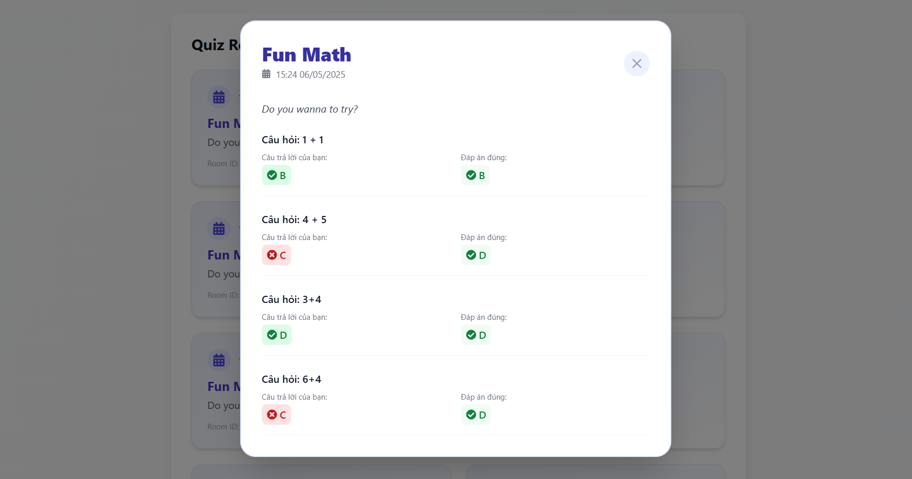

# Link github Front-end: [Link](https://github.com/dinhcongpham/quiz-app-vite)

# QuizApp

QuizApp is a web-based application designed to create, manage, and participate in online quizzes. Built with .NET Core, it leverages modern technologies like SignalR, JWT Authentication, and Entity Framework Core to deliver a seamless and secure user experience.

## Key Features

- **User Management**:
  - User registration, login, and account management.
  - Password reset and profile updates.
  - Email notifications for forgotten passwords.

- **Quiz Management**:
  - Create, edit, and delete quizzes.
  - Add questions with multiple-choice options and correct answers.
  - View a list of created quizzes.

- **Real-Time Game Rooms**:
  - Create game rooms for quizzes.
  - Join game rooms using room codes.
  - Real-time synchronization using SignalR.

- **Statistics and Leaderboards**:
  - View personal statistics such as quizzes created, participated, and accuracy rate.
  - Display leaderboards for players in game rooms.

- **Security**:
  - JWT-based authentication and authorization.
  - Password encryption using BCrypt.

## Technologies Used

- **Backend**:
  - .NET Core 8.0
  - Entity Framework Core
  - SignalR
  - Microsoft SQL Server

- **Frontend**:
  - API-ready for integration with any frontend framework.

- **Others**:
  - Docker for containerized deployment.
  - Swagger for API documentation.
  - MemoryCache for real-time data storage.

## Project Structure

- `QuizApp.API`: Contains API controllers and SignalR hubs.
- `QuizApp.Core`: Contains core interfaces and entities.
- `QuizApp.Infrastructure`: Contains services, repositories, and data access logic.
- `QuizApp.Shared`: Contains shared DTOs and helpers.
- `QuizApp.Tests`: Contains unit tests for the application.

## How to Run the Project

### Prerequisites

- .NET SDK 8.0 or higher
- Docker (optional for containerized deployment)
- SQL Server

### Steps

1. **Clone the Repository**:
   ```bash
   git clone <repository-url>
   cd QuizApp
   ```
2. **Configure the Database**:
- Update the connection string in appsettings.json and appsettings.Development.json
3. **Run the Application**:
- Using .NET CLI:
```bash
dotnet run --project QuizApp/QuizApp.csproj
```
- Using Docker:
```bash
docker-compose up
```
4. **Access The Application**:
- Open your browser and navigate to `http://localhost:5079/swagger` to view the API documentation.

## UI

- Login UI


- Register UI


- ForgotPassword UI


- Home UI


- Manage Quizs


- Manage Question


- How to play


- Waiting Room


- In game


- Finish game


- Profile


- History game




- Setting


